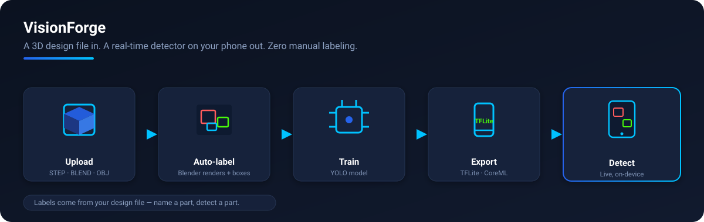
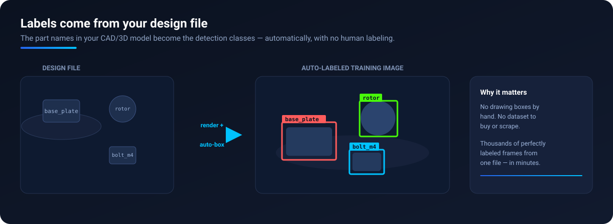

<div align="center">

# VisionForge

**Turn any 3D design file into a deployable, real-time object-detection model — no manual labeling.**

Upload a CAD assembly or Blender scene → VisionForge auto-generates labeled synthetic training images → trains a YOLO model → exports it to mobile → detects on-device.

[](LICENSE)
[](https://python.org)
[](https://fastapi.tiangolo.com)
[](https://flutter.dev)
[](https://docs.ultralytics.com)
[](docker-compose.yml)

[Quick Start](#quick-start) · [How It Works](#how-it-works) · [Architecture](#architecture) · [Setup](docs/SETUP.md) · [Documentation](#documentation)

</div>



---

## The Problem

Computer vision could verify assemblies, count parts, and guide field repairs — but for **custom industrial parts, it almost never gets built.** Four walls stand in the way:

- **Manual labeling is the bottleneck.** A usable detector needs thousands of hand-annotated photos. Drawing boxes around screws and brackets is slow, expensive, and error-prone — and it's wasted effort when a precise 3D model of the part already exists.
- **There's no data for niche parts.** You can't scrape or buy a dataset for *your* bracket, *your* rotor, *your* assembly. Public datasets stop at cats and cars.
- **It takes a CV team.** Going from a 3D model to a model running on a phone normally means ML engineers, a training pipeline, export tooling, and mobile integration — out of reach for most teams that actually have the parts.
- **Inspection stays manual.** On the floor and in the field, "is the right part there / is a screw missing?" is still answered by eye.

## The Solution

VisionForge turns the asset you already have — **the CAD or 3D model** — directly into a deployed, real-time detector, with **no human labeling and no ML expertise required.**

Because the geometry is known, the labels are free: Blender renders the part from thousands of randomized viewpoints and **writes perfect bounding boxes automatically.** The part names in your design file *become* the detection classes — nothing is hardcoded. Name a part `gear_housing`, and the model learns to detect `gear_housing`. Upload a file, and minutes later you have a model running live on a phone camera.

> **Upload a design file → get a detector on your phone.** That's the whole loop.

### Who it's for

- **Manufacturing & assembly QA** — verify the right components are present, count parts, catch a missing screw or bracket.
- **Field service & inspection** — point a phone at equipment to identify parts and guide maintenance.
- **Engineers & makers with CAD** — anyone holding 3D models who wants detection without standing up an ML team.
- **As a platform** — an end-to-end reference for CAD-to-deployed-detector automation.

### Capabilities

- **Any design file in** — `.step` / `.stp`, `.blend`, `.obj`, `.stl`, `.fbx`
- **Automatic labeling** — Blender renders images from randomized camera angles and lighting, emitting YOLO bounding boxes with zero manual annotation
- **Dynamic classes** — detection labels are derived from the model: CAD component names (Fusion 360 / SolidWorks / Inventor), Blender object names, or recognized STEP features (holes, bosses, chamfers). Overridable per project.
- **Annotated previews** — every render job produces preview images with boxes drawn on, so you can verify the dataset
- **YOLO training** — Ultralytics YOLO11 with automatic CUDA → MPS → CPU device selection
- **Mobile export** — TFLite (Android) and CoreML (iOS), served with a matching `labels.txt`
- **On-device inference** — a Flutter app runs the trained model live through the camera
- **Async by design** — FastAPI + Celery + Redis process render and training jobs in the background with live progress (polling or SSE)

## How It Works

The pipeline above looks simple; here's what actually happens at each stage, and the artifacts it produces.

### 1. Upload → a project
You upload a 3D file (`.step`, `.stp`, `.blend`, `.obj`, `.stl`, `.fbx`) via the app or `POST /api/v1/projects/upload`. The API stores it and creates a project record. Everything downstream is an async **job** tracked in PostgreSQL, so the client can poll `GET /jobs/{id}` or stream progress over SSE.

### 2. Render → labeled dataset (the part with no manual work)
A Celery worker drives **headless Blender (EEVEE)**. The class map is resolved *first*, from the file itself:

- **STEP assembly** → OpenCASCADE/XDE reads the component tree; each named part is a class.
- **STEP single part** → feature recognition extracts `hole`, `boss`, `chamfer`, `planar_face`.
- **`.blend` / meshes** → one class per named mesh object.
- **Override** → a project `class_map` you set via the API/app wins over all of the above.

Blender then renders N images from **randomized camera angles and lighting**, projecting each object's geometry to screen space to write a **YOLO label file** (`class x y w h`) per image — no human annotation. It emits:

```
datasets/<project>/render_<job>/
├── render_0000.png … render_NNNN.png     # images
├── render_0000.txt … render_NNNN.txt     # YOLO labels
├── class_map.json                        # object → class index + names + source
└── previews/                             # same images with boxes drawn on, for review
```

### 3. Train → a model that knows your classes
The train job locates the dataset, splits it train/val, writes `data.yaml`, and runs **Ultralytics YOLO**. Class names flow through from the render job (config override → render `class_names` → STEP features), so the model's class indices always map back to your real part names. Device is auto-selected **CUDA → MPS → CPU**, and the model task is matched to the label format (detection boxes vs. segmentation).

### 4. Export → mobile-ready model + labels
The trained `.pt` is converted through **PyTorch → ONNX → TensorFlow → TFLite** (and CoreML for iOS), and served alongside a matching **`labels.txt`**. The full export toolchain is pinned in the image, so this is reproducible and offline-safe.

### 5. Detect → live, on-device
The Flutter app downloads the TFLite model + `labels.txt`, sets it active, and runs inference on the camera feed. Because `labels.txt` rode along from step 2, the boxes on screen are named with **your** classes — the same names you started with in the design file.

## See It In Action

The core idea: **the part names in your design file become the detection classes**, and the training images are labeled automatically — no human draws a single box.



Every render job also produces a folder of preview images with the boxes drawn on, so you can verify the dataset before training — what you see is exactly what the model learns from.

## Quick Start

### Docker (recommended — Linux / Windows x86_64)

On x86_64 the entire stack runs in containers, including STEP feature recognition.

```bash
git clone https://github.com/dawarazhar11/VisionForge.git
cd VisionForge

docker compose up -d --build
docker compose exec backend alembic upgrade head     # first boot only

# API docs: http://localhost:8002/docs
```

Verify every dependency (including the TFLite export toolchain) is present:

```bash
docker compose exec backend python -c "import tensorflow, tf_keras, onnx, onnx2tf, ai_edge_litert, cadquery, ultralytics; print('OK')"
```

### Native (macOS / Linux without Docker)

```bash
scripts/setup/setup_backend.sh        # one-shot venv + full install + verification
source backend/.venv/bin/activate
alembic upgrade head
uvicorn app.main:app --host 0.0.0.0 --port 8002
```

See **[docs/SETUP.md](docs/SETUP.md)** for platform specifics (macOS ARM64 notes, why the export toolchain is pinned, GPU/MPS handling).

### Mobile app

```bash
cd flutter_app
flutter pub get
flutter run            # debug on a connected device/simulator
```

Set the backend URL on the login screen, sign in, then: **New Project → upload → render → train → download model → Detect**.

### Install on a phone (for end users)

- **Android** — download the latest **`app-release.apk`** from the [Releases](../../releases) page and install it (allow "install from unknown sources" once). No account, no fee. APKs are built automatically by [GitHub Actions](.github/workflows/build-android.yml) on each release.
- **iOS** — Apple has no free download-and-install path. Either build it yourself with a free Apple ID, or distribute via TestFlight (paid account). See **[docs/INSTALL.md](docs/INSTALL.md)** for both.

## Architecture

**Monorepo layout**

```
backend/        FastAPI API + Celery workers (auth, projects, jobs, models, monitoring)
  app/api/        REST route handlers
  app/workers/    Celery render & training tasks
  app/blender/    Blender subprocess integration + class-map resolution
  app/services/   STEP parsing (cadquery/XDE), preview generation, storage
  app/training/   YOLO training + multi-format export
blender/        Headless render scripts (generic .blend, STEP parts, STEP features)
flutter_app/    Cross-platform mobile client (camera, projects, training, models)
training/       Standalone training/analysis utilities
scripts/        Setup, Docker/Podman lifecycle, and E2E validation
docs/           Architecture, setup, and workflow guides
```

**Services** (`docker compose`): `backend:8002`, `postgres`, `redis`, `celery_worker`, `celery_beat`.

**Class resolution** (the heart of the dynamic-label system):

| Source | Becomes classes |
|--------|-----------------|
| STEP assembly with named components | One class per CAD part name |
| STEP single part | Recognized features (`hole`, `boss`, `chamfer`, `planar_face`) |
| `.blend` / mesh files | One class per named mesh object |
| Project override | A custom `class_map` set via the API/app |

Class names flow from the render job → training → the served `labels.txt`, so the model, the API, and the app always agree on what each detection means.

## Tech Stack

| Layer | Technology |
|-------|-----------|
| API | FastAPI, Uvicorn |
| Async jobs | Celery, Redis |
| Database | PostgreSQL, SQLAlchemy, Alembic |
| 3D / rendering | Blender (headless EEVEE) |
| CAD parsing | cadquery / OpenCASCADE (XDE) |
| ML | Ultralytics YOLO11, PyTorch |
| Export | TensorFlow + ONNX toolchain → TFLite, CoreML |
| Mobile | Flutter, tflite_flutter |
| Auth | JWT (HS256), bcrypt |

## Documentation

| Document | Description |
|----------|-------------|
| [Install (app)](docs/INSTALL.md) | Installing the mobile app — Android APK & iOS options |
| [Setup (backend)](docs/SETUP.md) | Install paths, dependency reproducibility, platform notes |
| [Architecture](docs/ARCHITECTURE.md) | System design and data flow |
| [Flutter Revamp](docs/FLUTTER_REVAMP.md) | Mobile app architecture |
| [Deployment](docs/DEPLOYMENT.md) | Production deployment |
| [Complete Workflow](docs/COMPLETE_WORKFLOW.md) | End-to-end walkthrough |
| [Platform Requirements](docs/PLATFORM_REQUIREMENTS.md) | Requirements by platform |

## Project Status

The end-to-end pipeline — upload → render → train → export → on-device detection — is implemented and validated. Detection quality depends on the training data: a model is only as good as the renders it learns from (more images, realistic materials, and more epochs improve real-world accuracy).

## License

MIT — see [LICENSE](LICENSE).
